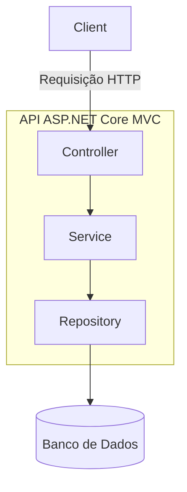
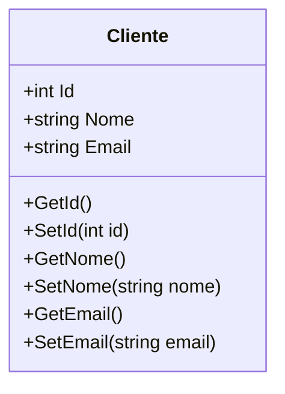

# xpe_desafiofinal_arq_2025
# 📦 Projeto API RESTful - ASP.NET Core (MVC)

## 🧩 Diagrama de Componentes - MVC



### 🧬 Diagrama de Entidade - Cliente



### 🗂️ Estrutura de Pastas - Projeto ASP.NET Core API

```
MyProject/
├── Controllers/
│   └── ClienteController.cs
│
├── Models/
│   └── Cliente.cs
│
├── Services/
│   └── ClienteService.cs
│
├── Repositories/
│   └── ClienteRepository.cs
│
├── Data/
│   └── AppDbContext.cs
│
├── appsettings.json
├── Program.cs
└── Startup.cs
```

### 📘 Explicação dos Componentes


| Pasta/Arquivo          | Descrição                                                                       |
| ---------------------- | ------------------------------------------------------------------------------- |
| `Controllers/`         | Controladores que recebem requisições HTTP e retornam respostas JSON.           |
| `Models/`              | Entidades de domínio. Cada classe representa uma tabela no banco (ex: Cliente). |
| `Services/`            | Camada de lógica de negócio. Regras e validações.                               |
| `Repositories/`        | Acesso direto aos dados (via Entity Framework, Dapper etc).                     |
| `Data/AppDbContext.cs` | Define o contexto do banco e as configurações de entidades.                     |
| `Program.cs`           | Ponto de entrada da aplicação.                                                  |
| `Startup.cs`           | Configurações de serviços e middlewares da aplicação.                           |


### ✅ Endpoints REST Esperados

* GET /clientes → Lista todos os clientes
* GET /clientes/{id} → Busca cliente por ID
* GET /clientes/nome/{nome} → Busca cliente pelo nome
* GET /clientes/contar → Conta total de clientes
* POST /clientes → Cria novo cliente
* PUT /clientes/{id} → Atualiza cliente
* DELETE /clientes/{id} → Remove cliente