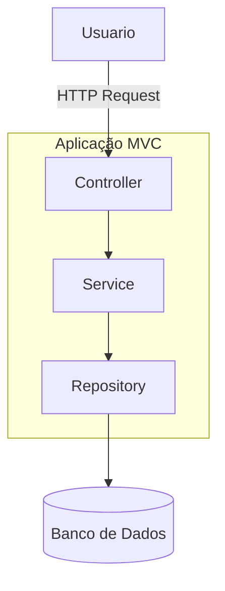

# xpe_desafiofinal_arq_2025

###Driagrama de componentes

```mermaid
graph TD
  A[Usuario] -->|HTTP Request| B[Controller]
  B --> C[Service]
  C --> D[Repository]
  D --> E[(Banco de Dados)]

  subgraph Aplicação MVC
    B
    C
    D
  end
```